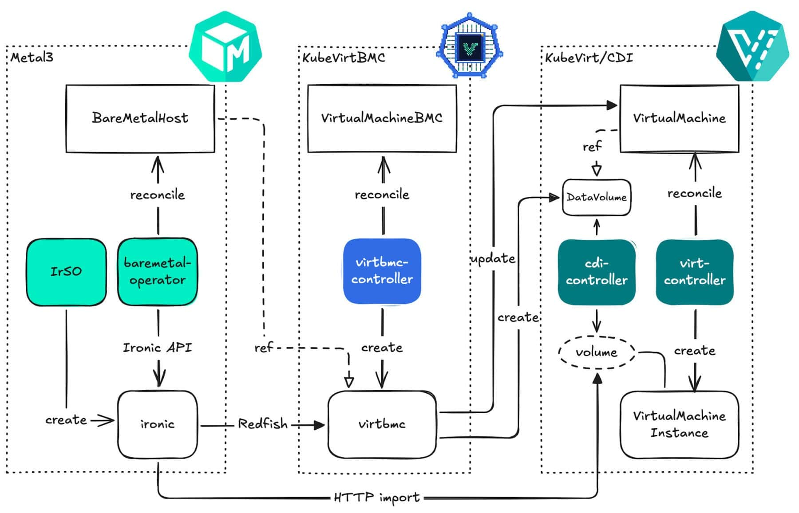

# Blog

News, tutorials, and community write-ups about KubeVirtBMC.

- 

    ---

    **[Metal3 meets KubeVirtBMC: Provisioning KubeVirt VMs Like Bare Metal](https://www.cncf.io/blog/2026/09/02/metal3-meets-kubevirtbmc-provisioning-kubevirt-vms-like-bare-metal/)**

    :octicons-calendar-24: September 2, 2026 · CNCF Blog

    KubeVirtBMC provides virtual BMC endpoints for KubeVirt VMs, letting Metal3's Ironic component manage them through the same bare-metal provisioning workflows used for physical servers, no dedicated hardware required. This walkthrough covers installing cert-manager, KubeVirtBMC, and the Metal3 stack, then provisioning a VM with an OS image over virtual media.

    [:octicons-arrow-right-24: Read on the CNCF Blog](https://www.cncf.io/blog/2026/09/02/metal3-meets-kubevirtbmc-provisioning-kubevirt-vms-like-bare-metal/)

